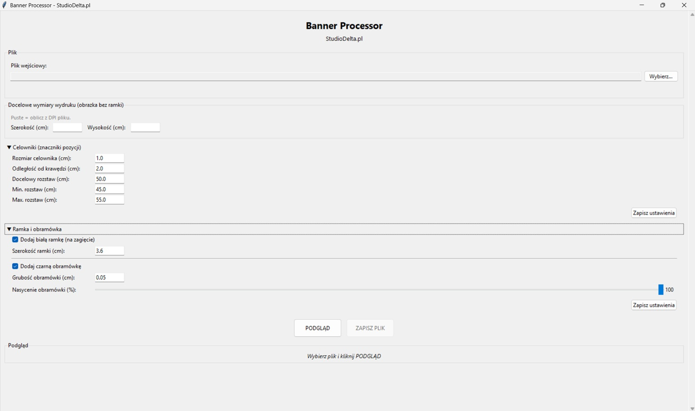
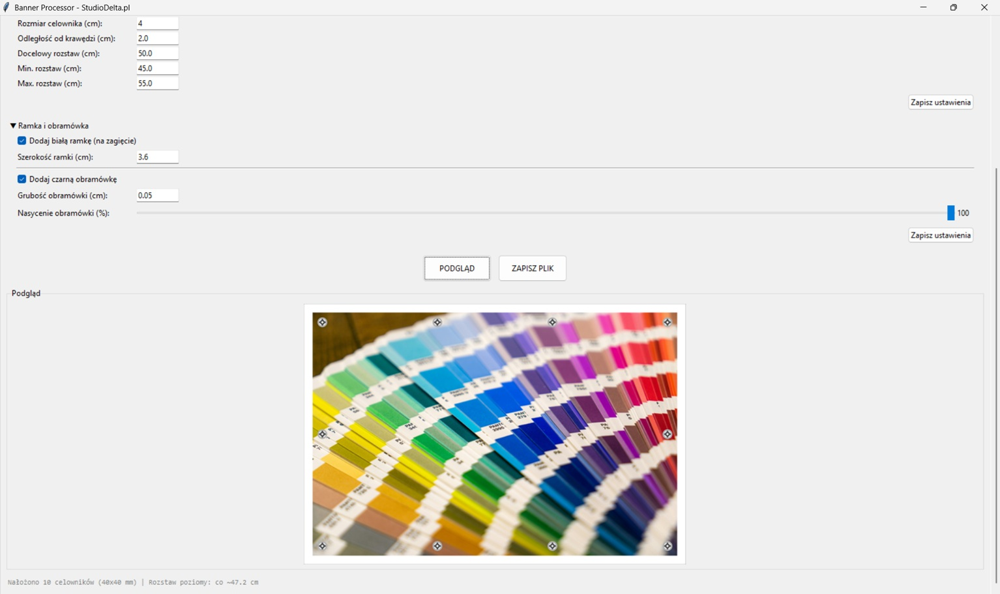

# Banner Processor

A tool for preparing graphics files for large-format printing. I wrote it during my internship at Studio Delta (a large-format print shop) and it's used there in production now.

Before every print run someone had to add registration marks and a border by hand, which took a few minutes and was easy to get slightly crooked. This script does it automatically and saves the finished file.

## What it does

- Adds registration marks and picks their number and spacing automatically based on the banner size (default around every 50 cm)
- Adds a white border for folding/hanging (default 3.6 cm)
- Draws a black outline along the edge (default around 0.5 mm)
- Keeps the ICC profile and DPI, so a CMYK file comes out as CMYK with its profile



## Running it

Requirements: Python 3.8+, Pillow

```bash
pip install Pillow
python main.py
```

Without arguments it launches the GUI. With an argument it runs as a CLI:

```bash
python main.py baner.tif
python main.py baner.tif -o wynik.jpg --width 300 --height 150
python main.py baner.tif --no-border --spacing 40
python main.py --help
```

## GUI

After picking a file you can click PREVIEW to see the result before saving. Settings (mark spacing, border width and so on) are saved to `banner_processor_config.json` next to the exe/script.



## Supported formats

Input: TIFF, JPEG, PNG, PSD (needs Pillow with PSD support)
Output: JPEG (quality 100%) or TIFF (LZW compression)
Color spaces: RGB and CMYK

## Parameters

All have defaults matched to the print shop workflow:

| Parameter | Default | What it does |
|----------|-----------|---------|
| `marker_size` | 1.0 cm | mark size (10x10 mm) |
| `margin` | 2.0 cm | distance from the mark to the edge |
| `target_spacing` | 50.0 cm | target spacing between marks |
| `min_spacing` | 45.0 cm | lower spacing limit |
| `max_spacing` | 55.0 cm | upper spacing limit |
| `border` | 3.6 cm | white border for folding |
| `line_width` | 0.05 cm | black outline thickness |
| `line_opacity` | 100% | outline opacity |

## How the marks are placed

There are always 4 in the corners. For longer sides the program picks the number of intermediate marks so the spacing is as close to 50 cm as possible and stays within [45-55 cm]. If the gap between the outermost marks is smaller than about 82 cm, no intermediate marks are added.

## Building the exe (Windows)

```bash
pip install pyinstaller
pyinstaller BannerProcessor_v2.spec
```

The finished file lands in `dist/`.

## Known limitations

- The CMYK preview in the GUI is converted to RGB without the ICC profile, so the colors in the preview can differ from the print
- If a file has no DPI metadata, the program assumes 150 DPI and shows a warning, in which case you have to enter the dimensions manually

## More

Portfolio: [wojtas.it](https://wojtas.it)
